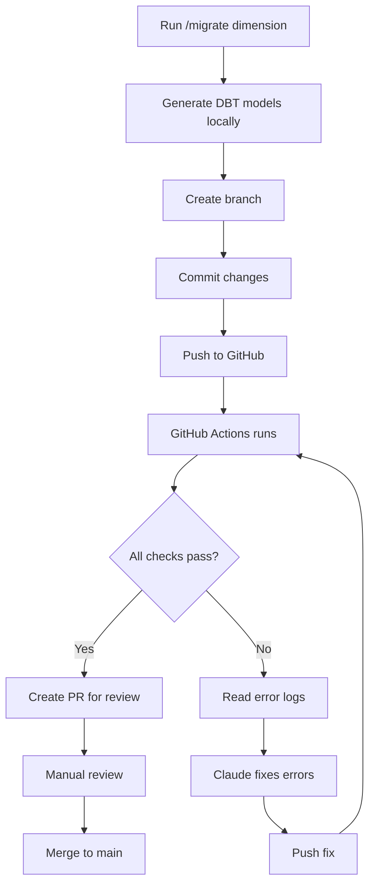

# GitHub CI/CD Workflow for DBT Migrations

**Purpose:** Automated validation of DBT models when migrating from Pentaho.

**When to use:** After migrating to GitHub (planned in 2 days).

---

## Overview

This document explains how to set up and use GitHub Actions to automatically validate DBT models generated by our migration system.

### Workflow Summary



---

## Phase 1: Current Workflow (No CI/CD Yet)

**What you do now:**
1. Run `/migrate dim_approval_level`
2. Review generated models manually
3. Create branch and commit
4. Create PR/MR
5. Manually test in Snowflake
6. Merge if everything works

**Keep doing this until GitHub Actions is set up!**

---

## Phase 2: GitHub Actions Setup (After GitHub Migration)

### Step 1: Create GitHub Actions Workflow File

**File:** `.github/workflows/dbt_validation.yml`

```yaml
name: DBT Model Validation

on:
  pull_request:
    branches: [ main, develop ]
    paths:
      - 'models/**'
      - 'dbt_project.yml'

jobs:
  dbt-validation:
    runs-on: ubuntu-latest

    steps:
      - name: Checkout code
        uses: actions/checkout@v3

      - name: Set up Python
        uses: actions/setup-python@v4
        with:
          python-version: '3.10'

      - name: Install DBT
        run: |
          pip install dbt-snowflake==1.7.0

      - name: Create profiles.yml
        run: |
          mkdir -p ~/.dbt
          cat > ~/.dbt/profiles.yml <<EOF
          tfses_3030:
            target: ci
            outputs:
              ci:
                type: snowflake
                account: ${{ secrets.SNOWFLAKE_ACCOUNT }}
                user: ${{ secrets.SNOWFLAKE_CI_USER }}
                password: ${{ secrets.SNOWFLAKE_CI_PASSWORD }}
                role: CI_DEVELOPER
                warehouse: CI_WH_SMALL
                database: TFSES_ANALYTICS_DEV
                schema: ci_${{ github.head_ref }}
                threads: 4
          EOF

      - name: DBT Debug (Check connection)
        run: dbt debug

      - name: DBT Deps (Install packages)
        run: dbt deps

      - name: DBT Compile (Syntax check)
        run: dbt compile

      - name: DBT Run (Create models)
        run: |
          # Extract dimension from branch name (e.g., migrate/dim_customer -> dim_customer)
          DIMENSION=$(echo ${{ github.head_ref }} | sed 's/migrate\///')
          dbt run --models tag:$DIMENSION --target ci

      - name: DBT Test (Data quality tests)
        run: |
          DIMENSION=$(echo ${{ github.head_ref }} | sed 's/migrate\///')
          dbt test --models tag:$DIMENSION --target ci

      - name: Cleanup (Drop CI schema)
        if: always()
        run: |
          dbt run-operation drop_schema --args "{schema_name: ci_${{ github.head_ref }}}"
```

### Step 2: Add GitHub Secrets

Go to: **Repository Settings → Secrets and variables → Actions → New repository secret**

Add these secrets:

| Secret Name | Value | Example |
|-------------|-------|---------|
| `SNOWFLAKE_ACCOUNT` | Your Snowflake account ID | `xy12345.us-east-1` |
| `SNOWFLAKE_CI_USER` | CI service account username | `svc_github_ci` |
| `SNOWFLAKE_CI_PASSWORD` | CI service account password | `<secure-password>` |

### Step 3: Create Snowflake CI User (Ask your DBA)

```sql
-- Create CI service account (DBA runs this)
CREATE USER svc_github_ci
  PASSWORD = '<secure-password>'
  DEFAULT_ROLE = CI_DEVELOPER
  MUST_CHANGE_PASSWORD = FALSE;

-- Create CI developer role
CREATE ROLE CI_DEVELOPER;

-- Grant permissions (only on DEV database)
GRANT USAGE ON DATABASE TFSES_ANALYTICS_DEV TO ROLE CI_DEVELOPER;
GRANT USAGE ON SCHEMA TFSES_ANALYTICS_DEV.TFS_BRONZE TO ROLE CI_DEVELOPER;
GRANT SELECT ON ALL TABLES IN SCHEMA TFSES_ANALYTICS_DEV.TFS_BRONZE TO ROLE CI_DEVELOPER;
GRANT CREATE SCHEMA ON DATABASE TFSES_ANALYTICS_DEV TO ROLE CI_DEVELOPER;

-- Grant warehouse usage
GRANT USAGE ON WAREHOUSE CI_WH_SMALL TO ROLE CI_DEVELOPER;

-- Assign role to user
GRANT ROLE CI_DEVELOPER TO USER svc_github_ci;
```

**Important:** CI user can only:
- Read from bronze layer
- Create schemas/tables in DEV database only
- Cannot touch production

---

## Phase 3: Using the Workflow

### When You Migrate a Dimension

**1. Run migration locally:**
```bash
/migrate dim_customer
```

**2. Create branch:**
```bash
git checkout -b migrate/dim_customer
```

**3. Commit changes:**
```bash
git add models/ dimensions/dim_customer/
git commit -m "feat: migrate dim_customer from Pentaho

- Generated 10 DBT models
- Added 25 data quality tests
- Documentation: 100%"
```

**4. Push to GitHub:**
```bash
git push -u origin migrate/dim_customer
```

**5. GitHub Actions runs automatically:**
- You'll see checks in the PR
- Wait 2-5 minutes for completion

**6. Check results:**

**If all checks pass (✅):**
```
✅ DBT Debug         passing
✅ DBT Compile       passing
✅ DBT Run          passing
✅ DBT Test         passing
```
→ Create PR, request review, merge when approved

**If checks fail (❌):**
```
✅ DBT Debug         passing
✅ DBT Compile       passing
❌ DBT Run          failing
⚪ DBT Test         pending
```
→ Follow error handling procedure below

---

## Error Handling Procedures

### Option A: Manual Error Review (Simple)

**1. Click on failed check in GitHub:**
- Go to your PR
- Click on "Details" next to failed check
- Scroll to the error

**2. Copy error message:**
```
Database Error in model stg_contracts
  002003 (42S02): SQL compilation error:
  Object 'TFSES_ANALYTICS.TFS_BRONZE.EKIP_CONTRACT' does not exist
```

**3. Paste to Claude:**
```
You: "CI failed, here's the error:"
[paste error]

Claude: "The table name is wrong. Should be EKIP_AFFAIRE not EKIP_CONTRACT.
         Let me fix it..."
[Claude fixes the file]
[Claude commits and pushes]

Claude: "Fixed! Push complete. CI will run again automatically."
```

**4. Wait for CI to re-run:**
- GitHub automatically triggers checks on new push
- Should pass now

---

### Option B: Automated Error Review (Advanced)

**Prerequisites:**
```bash
# Install GitHub CLI (one time)
# Windows:
winget install GitHub.cli

# macOS:
brew install gh

# Authenticate (one time)
gh auth login
```

**Usage:**

**1. Tell Claude your PR failed:**
```
You: "CI failed on branch migrate/dim_customer"
```

**2. Claude fetches logs automatically:**
```bash
# Claude runs these commands:
gh pr checks

# If failed, Claude fetches error logs:
gh run view <run-id> --log-failed
```

**3. Claude analyzes and fixes:**
```
Claude: "Found the issue - wrong table name in stg_contracts.sql line 45.
         Fixing now..."
[Claude edits file]
[Claude commits]
[Claude pushes]

Claude: "✅ Fixed and pushed. CI running again..."
```

**4. CI re-runs automatically**

---

## Common CI/CD Errors & Solutions

### Error 1: Table Does Not Exist

**Error message:**
```
Object 'TFSES_ANALYTICS.TFS_BRONZE.EKIP_CONTRACT' does not exist
```

**Cause:** Wrong table name in source reference

**Solution:**
```sql
-- Fix in models/silver/silver_adq/stg_contracts.sql
-- BEFORE:
{{ source('bronze', 'EKIP_CONTRACT') }}

-- AFTER:
{{ source('bronze', 'EKIP_AFFAIRE') }}
```

**Claude can auto-fix:** ✅ Yes

---

### Error 2: Source Not Found

**Error message:**
```
Source 'bronze.EKIP_NEW_TABLE' was not found
```

**Cause:** Table not defined in `_sources.yml`

**Solution:**
```yaml
# Add to models/bronze/_sources.yml
sources:
  - name: bronze
    tables:
      - name: EKIP_NEW_TABLE
        description: New table from EKIP
```

**Claude can auto-fix:** ✅ Yes

---

### Error 3: Column Not Found

**Error message:**
```
SQL compilation error: invalid identifier 'CONTRACT_ID'
```

**Cause:** Column doesn't exist in source table or wrong name

**Solution:**
1. Check source table schema in Snowflake
2. Fix column name in model
3. Or add column to SELECT if missing

**Claude can auto-fix:** ⚠️ Partial (needs you to confirm correct column name)

---

### Error 4: Circular Dependency

**Error message:**
```
Found a cycle: stg_contracts -> mas_contracts -> stg_contracts
```

**Cause:** Models reference each other in a loop

**Solution:**
1. Review dependency graph
2. Break cycle by using ephemeral model
3. Or reorder transformations

**Claude can auto-fix:** ⚠️ Partial (needs review of business logic)

---

### Error 5: SQL Syntax Error

**Error message:**
```
SQL compilation error: syntax error at or near "FORM"
```

**Cause:** Typo in SQL (FORM instead of FROM)

**Solution:**
```sql
-- Fix typo
-- BEFORE:
FORM {{ source('bronze', 'EKIP_AFFAIRE') }}

-- AFTER:
FROM {{ source('bronze', 'EKIP_AFFAIRE') }}
```

**Claude can auto-fix:** ✅ Yes

---

### Error 6: Custom UDF Not Found

**Error message:**
```
SQL compilation error: Unknown function GETENUMML
```

**Cause:** Custom UDF not deployed to Snowflake DEV environment

**Solution:**
1. Deploy custom UDFs to TFSES_ANALYTICS_DEV database
2. Or wait for UDF expansion feature (auto-converts to SQL)

**Claude can auto-fix:** ⚠️ No (requires DBA to deploy UDF)

---

## Quick Reference

### Check CI Status
```bash
# List all checks on PR
gh pr checks

# View specific run logs
gh run list --limit 5
gh run view <run-id> --log

# View only failed steps
gh run view <run-id> --log-failed
```

### Re-run Failed Jobs
```bash
# Re-run all failed jobs
gh run rerun <run-id> --failed

# Re-run entire workflow
gh run rerun <run-id>
```

### View PR Status
```bash
# Check PR status
gh pr status

# View PR details
gh pr view <pr-number>
```

---

## Troubleshooting

### GitHub Actions Not Running

**Check:**
1. Is workflow file in `.github/workflows/`?
2. Does PR touch `models/**` files?
3. Are GitHub Secrets configured?

**Debug:**
```bash
# Check workflow syntax
gh workflow view dbt_validation.yml
```

---

### Snowflake Connection Failed

**Error message:**
```
Database Error: 250001: Could not connect to Snowflake backend
```

**Check:**
1. Are GitHub Secrets correct?
2. Is Snowflake account ID correct?
3. Is CI user created in Snowflake?
4. Does CI user have correct permissions?

**Test locally:**
```bash
# Test connection with same credentials
dbt debug --profiles-dir ~/.dbt
```

---

### CI Running Too Long

**Normal times:**
- DBT Compile: 30-60 seconds
- DBT Run: 2-5 minutes (depends on model complexity)
- DBT Test: 1-3 minutes

**If longer than 10 minutes:**
1. Check for runaway queries
2. Check Snowflake warehouse size
3. Cancel and re-run

---

## Best Practices

### 1. Branch Naming Convention
```
✅ migrate/dim_customer
✅ migrate/dim_approval_level
❌ customer-migration
❌ new-models
```
Reason: GitHub Actions extracts dimension name from branch

---

### 2. Commit Messages
```
✅ feat: migrate dim_customer from Pentaho

- Generated 10 DBT models
- Added 25 tests
- Documentation: 100%

❌ added models
❌ wip
```
Reason: Clear history, easier to track changes

---

### 3. Review Before Merging
Even if CI passes:
1. Review complex models (25+ joins)
2. Check data quality test results
3. Verify materialization strategies
4. Test in Snowflake manually if needed

---

### 4. Keep Branches Small
```
✅ One dimension per branch
❌ Multiple dimensions in one PR
```
Reason: Easier to review, easier to debug

---

## Timeline

### Week 1 (After GitHub Migration)
- [x] Create `.github/workflows/dbt_validation.yml`
- [ ] Add GitHub Secrets
- [ ] Request DBA to create CI user
- [ ] Test with one dimension migration

### Week 2
- [ ] Run 2-3 dimension migrations with CI
- [ ] Fix any workflow issues
- [ ] Document lessons learned

### Week 3+
- [ ] Consider adding auto-fix capabilities
- [ ] Add more sophisticated checks
- [ ] Optimize CI run times

---

## Need Help?

### Common Questions

**Q: Can I run CI locally before pushing?**
A: Yes! Use `dbt compile` and `dbt run --target local_test` with your own credentials.

**Q: What if CI fails but models work locally?**
A: Check for differences between your local Snowflake and CI environment (table names, schemas, permissions).

**Q: Can I skip CI for work-in-progress?**
A: Yes! Create a draft PR. CI will run but you can ignore failures until ready for review.

**Q: How do I debug complex SQL errors?**
A: Copy the failing model SQL, run it directly in Snowflake, see which line fails.

---

## Contact

- **For CI/CD issues:** Ask Claude (paste error logs)
- **For Snowflake permissions:** Contact DBA team
- **For GitHub Actions:** Check GitHub docs or ask Claude

---

**Last Updated:** 2025-10-25
**Version:** 1.0
**Owner:** Data Engineering Team
